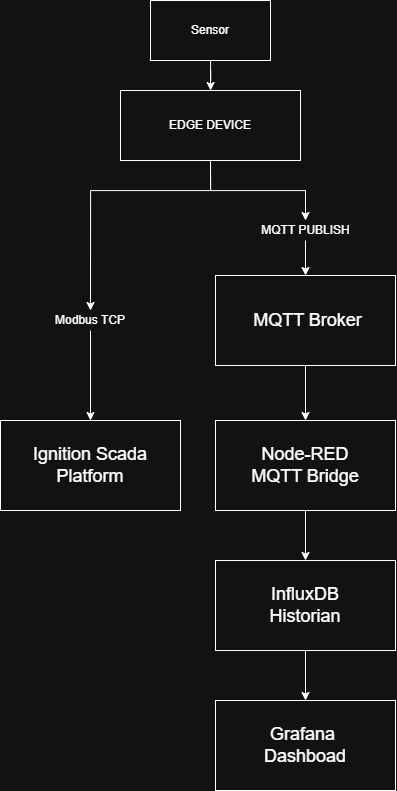
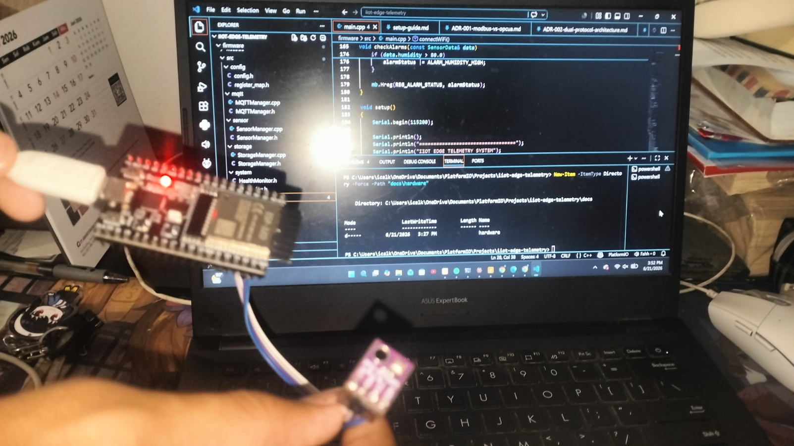
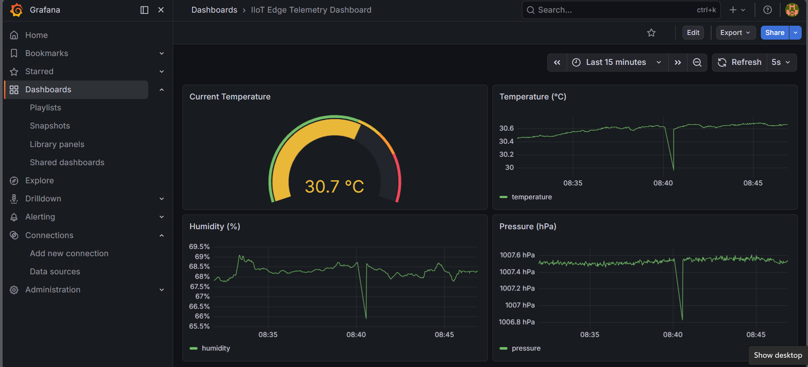
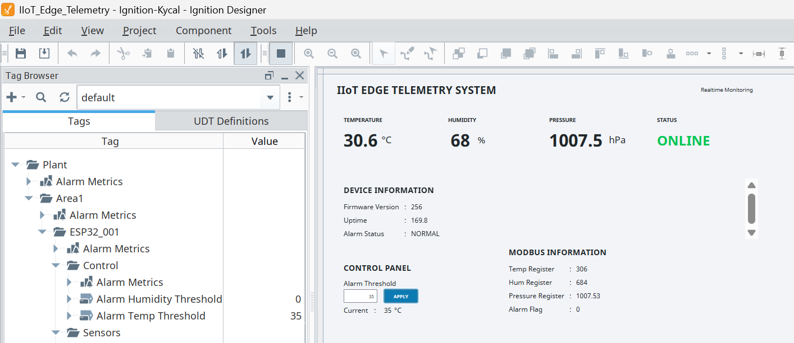

# SCADA-Integrated Edge Telemetry System (IIoT Architecture)

> An industrial-grade IIoT simulation demonstrating dual-protocol edge telemetry — combining real-time SCADA control (Modbus TCP) with cloud-oriented historian/analytics (MQTT) on a single ESP32 Remote Terminal Unit.


---

## Overview

This project simulates a real-world Industrial IoT deployment commonly found in manufacturing, utilities, and process automation environments. An ESP32 functions as a **Remote Terminal Unit (RTU)**, reading environmental sensor data (temperature, humidity, pressure) and exposing it through two independent communication paths:

1. **SCADA path (Modbus TCP)** — for deterministic, low-latency polling by industrial control systems (Ignition SCADA)
2. **IT/Cloud path (MQTT)** — for asynchronous telemetry publishing to a historian and analytics stack (InfluxDB + Grafana)

This dual-protocol pattern reflects how real industrial systems separate **operational technology (OT)** from **information technology (IT)** layers — consistent with the [ISA-95 / Purdue Enterprise Reference Architecture](https://en.wikipedia.org/wiki/Purdue_Enterprise_Reference_Architecture) model, where Level 2 (SCADA/control) and Level 4–5 (enterprise/cloud analytics) operate independently but share the same field data source.

The project was built end-to-end as a portfolio piece — firmware, protocol implementation, SCADA configuration, and data pipeline — to demonstrate practical competency for **IoT Engineer, Embedded Engineer, Firmware Engineer, Industrial Automation Engineer,** and **SCADA Engineer** roles.

---

## Architecture



The sensor data originates at the Edge Device (ESP32) and splits into two independent paths: **Modbus TCP** to Ignition SCADA for real-time monitoring/control, and **MQTT Publish** to Mosquitto Broker, which feeds Node-RED → InfluxDB Historian → Grafana Dashboard for time-series analytics.

**Key architectural property:** the two paths are *independent*. If the MQTT broker goes down, the SCADA/Modbus path continues operating unaffected (validated — see [Testing & Validation](#testing--validation)). This is not just a diagram claim; it was tested by deliberately stopping Mosquitto while Ignition remained connected and polling normally.

Full data flow diagram: [`docs/architecture/data-flow-diagram.png`](docs/architecture/data-flow-diagram.png)

---

## Key Features

- **Modbus TCP Server (Slave)** running on ESP32 — exposes sensor data and system status via Holding Registers, with both read (FC03) and write (FC06) support
- **Dynamic, writable alarm thresholds** — alarm setpoints can be updated remotely from Ignition or any Modbus master, not hardcoded in firmware
- **MQTT telemetry publisher** with structured JSON payloads, QoS 1, and Last Will & Testament (LWT) for offline detection
- **Store-and-Forward buffering** — telemetry is cached to SPIFFS flash storage when the MQTT broker is unreachable, then automatically replayed once connectivity is restored
- **NTP-synchronized timestamps** — all telemetry uses Unix epoch time, not relative `millis()`, making it directly usable by time-series databases
- **Non-blocking firmware architecture** — state-machine driven main loop, no blocking `delay()` calls in the critical path
- **Hardware watchdog** — automatic recovery on firmware lockup
- **SCADA integration via Ignition** — industry-standard platform, includes a Perspective-based operator dashboard with live values and a write-back control panel
- **Time-series historian** via InfluxDB, fed through a Node-RED transformation bridge
- **Real-time Grafana dashboard** with gauge, trend, and threshold visualization

---

## Tech Stack

| Layer | Technology | Purpose |
|---|---|---|
| Firmware | ESP32, C++, PlatformIO | Sensor acquisition, protocol servers |
| Sensor | BME280 (I2C) | Temperature, humidity, pressure |
| Industrial Protocol | Modbus TCP | SCADA-facing real-time data exchange |
| Messaging | MQTT (Mosquitto) | Lightweight pub/sub telemetry |
| SCADA | Ignition (Perspective) | Industrial monitoring & control HMI |
| Pipeline | Node-RED | MQTT → InfluxDB transformation bridge |
| Historian | InfluxDB v2 | Time-series data storage |
| Visualization | Grafana | Real-time dashboards |
| Documentation | draw.io | Architecture & data flow diagrams |
| Version Control | Git / GitHub | Source control |

---

## Hardware Setup



The system runs on a physical ESP32 DevKit connected to a BME280 sensor via I2C, validated end-to-end on real hardware — not simulated.

| Component | Spec |
|---|---|
| Microcontroller | ESP32 DevKit |
| Sensor | BME280 (I2C, address 0x76) |
| Connectivity | WiFi (802.11 b/g/n) |

---

## System Demo

[Demo video link — replace with your YouTube/unlisted link]

**Grafana Dashboard:**



**Ignition SCADA — Perspective View:**



---

## Project Structure

```
scada-integrated-edge-telemetry-system/
├── firmware/                  # ESP32 firmware (PlatformIO project)
│   ├── src/
│   │   ├── config/             # System config & Modbus register map
│   │   ├── sensor/             # BME280 sensor abstraction
│   │   ├── mqtt/                # MQTT manager (publish/subscribe/LWT)
│   │   ├── storage/             # Store-and-Forward (SPIFFS) buffer
│   │   ├── system/              # Watchdog & health monitoring
│   │   └── main.cpp
│   └── platformio.ini
├── docs/
│   ├── architecture/            # System & data flow diagrams
│   ├── firmware/                # Register map, state machine docs
│   ├── ignition/                 # SCADA setup guide & screenshots
│   ├── node-red/                  # Exported flow + notes
│   ├── grafana/                   # Exported dashboard + screenshots
│   ├── mqtt/                      # Topic schema & payload spec
│   └── adr/                       # Architecture Decision Records
└── screenshots/                   # Chronological validation evidence
```

Full breakdown of each module is documented under [`docs/`](docs/).

---

## Quick Start

> This project is presented primarily as a portfolio reference. The steps below let you reproduce the firmware behavior; SCADA/dashboard tools require separate installation.

**1. Firmware**
```bash
git clone https://github.com/icalkyrie-dotcom/scada-integrated-edge-telemetry-system.git
cd scada-integrated-edge-telemetry-system/firmware
```
Edit `src/config/config.h` with your WiFi credentials and MQTT broker IP, then build/upload via PlatformIO:
```bash
pio run --target upload
pio device monitor
```

**2. Verify Modbus TCP**
Use [Modbus Poll](https://www.modbustools.com/modbus_poll.html) (or any Modbus master) to connect to the ESP32's IP on port `502`, Unit ID `1`. See [register map](docs/firmware/register-map.md) for addresses.

**3. Verify MQTT**
Run a local Mosquitto broker and subscribe to `plant/area_1/esp32_001/#` using [MQTT Explorer](http://mqtt-explorer.com/) to observe telemetry, status, and alarm topics.

**4. SCADA / Historian (optional)**
Setup guides for Ignition, Node-RED, InfluxDB, and Grafana are in [`docs/`](docs/).

---

## Documentation

> Status legend: ✅ available now · 🚧 in progress (referenced but not yet written)

- ✅ [System Architecture Diagram](docs/architecture/system-architecture.png) (source: `.drawio` included)
- ✅ [Data Flow Diagram](docs/architecture/data-flow-diagram.png)
- ✅ [Node-RED Flow Export](docs/node-red/flow-export.json)
- ✅ [Grafana Dashboard Export](docs/grafana/dashboard-export.json)
- 🚧 [Modbus Register Map](docs/firmware/register-map.md)
- 🚧 [MQTT Topic & Payload Schema](docs/mqtt/topic-schema.md)
- 🚧 [Ignition SCADA Setup Guide](docs/ignition/setup-guide.md)
- 🚧 [Architecture Decision Records](docs/adr/)
  - [ADR-001: Modbus TCP vs OPC-UA](docs/adr/ADR-001-modbus-vs-opcua.md)
  - [ADR-002: Dual-Protocol Architecture](docs/adr/ADR-002-dual-protocol-architecture.md)
  - [ADR-003: Store-and-Forward Design](docs/adr/ADR-003-store-and-forward-design.md)

---

## Testing & Validation

All core functionality has been tested end-to-end. Summary:

| Test | Result |
|---|---|
| Modbus Poll reads all Holding Registers correctly | ✅ PASS |
| Modbus write (FC06) updates alarm threshold on device | ✅ PASS |
| MQTT telemetry/status/alarm publish correctly | ✅ PASS |
| MQTT command subscribe (`ping`, `status`, `reboot`) | ✅ PASS |
| Store-and-Forward buffers data when broker is offline | ✅ PASS |
| Store-and-Forward replays buffered data on reconnect | ✅ PASS |
| Ignition tags update in real time via Modbus TCP | ✅ PASS |
| Node-RED → InfluxDB → Grafana pipeline updates live | ✅ PASS |
| **Independent-path validation**: Mosquitto stopped, Modbus/Ignition path unaffected | ✅ PASS |
| Ignition reconnects automatically after ESP32 power cycle | ✅ PASS |

The independent-path test is the most architecturally significant: it confirms the SCADA and historian paths are genuinely decoupled, not just labeled separately in a diagram.

---

## Known Limitations

- **Ignition trial licensing**: this project uses Ignition's free trial mode, which resets connections every 2 hours. This is a licensing constraint, not a system defect — documented here for transparency.
- **Single-node deployment**: the current system runs a single ESP32 RTU. Multi-node architecture (multiple field devices reporting to the same SCADA/historian stack) is identified as future work.
- **Local network only**: MQTT and Modbus TCP currently operate on a local/trusted network without TLS. Production deployment would require TLS for MQTT and VPN/segmentation for Modbus TCP, consistent with IEC 62443 industrial security practices.
- **No multi-device fault isolation**: watchdog and health monitoring exist at the device level; cluster-wide fault tolerance across multiple RTUs is not yet implemented.

---

## Roadmap / Future Work

- [ ] Multi-node architecture (additional ESP32 RTUs on the same network)
- [ ] TLS-secured MQTT and authenticated Modbus access
- [ ] Edge-side data aggregation/filtering before publish
- [ ] Containerized deployment (Docker Compose for Mosquitto, Node-RED, InfluxDB, Grafana)

---

## Author

**Faisal Atmaja**
IoT / Embedded Systems Engineer
[LinkedIn](https://www.linkedin.com/in/faisal-atmaja-b38330356) · [faisalatmaja30@gmail.com](mailto:faisalatmaja30@gmail.com) · [GitHub](https://github.com/icalkyrie-dotcom)

---

## License

This project is licensed under the MIT License — see [LICENSE](LICENSE) for details.
